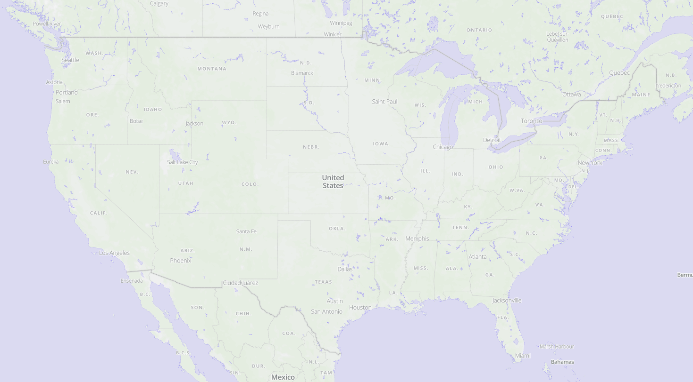
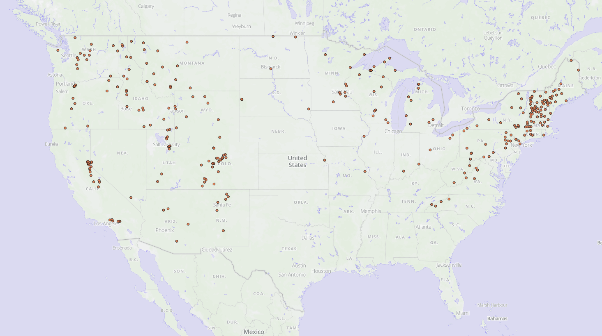
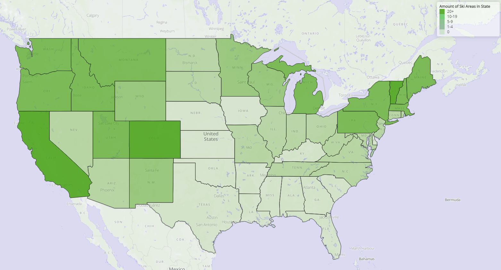
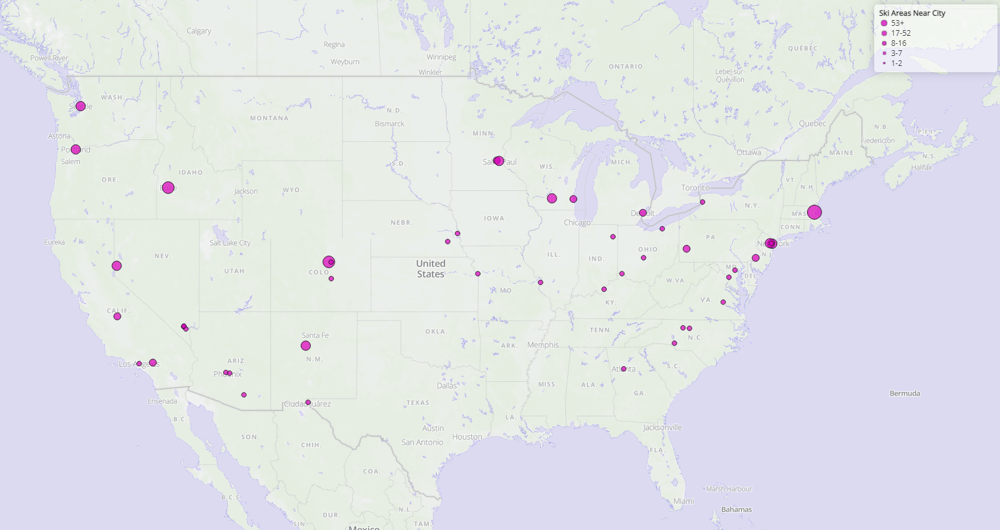
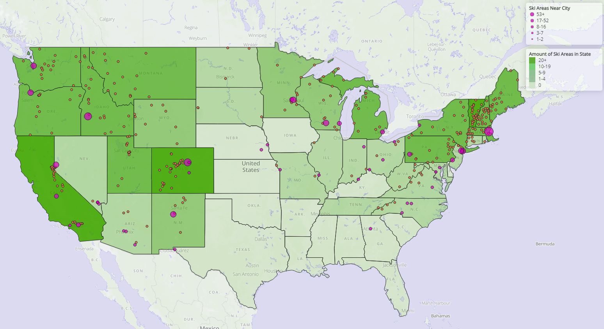

# The best places to live for a skier who loves the city

### GEOG 458 - Lab 4 - Corin Zarkowski
---

## Description
In this assignment I attempt to find the best places for skiers to live, based off both locations of ski areas and major cities.

My first endeavor was to create a basemap--for this I really wanted to keep it simple, but make some minor changes to demonstrate my understanding of MapBox.
I used a light monochrome basemap as a base, and minimized font sizes for minor cities, erased minor roads, added a little color, and enlarged/changed fonts for state names.

Next, I needed data on ski areas in the United States. Sadly, this data was not aggregated anywhere, so I had to do it myself. I wrote a quick little python script with a lot of regex to go through wikipedia and scrape names and coordinates of all ski areas located in the United States. After attaining the raw data, I reformatted it to geojson for further use--the raw ski area location data is visible below.

Honestly, this alone provides a pretty good look into where you would want to live as a skier. To expand on this, I did some data wrangling and made a choropleth of states by ski areas within their boundaries. There is one ski area exactly on the border of Montana and Idaho, so I decided that since it is pretty much accessible from both states, it should be counted within both. I sourced the state lines shapefile from a MapBox tutorial, which sourced it from a leaflet tutorial.

This map provides a good look into the best states to live in as a skier, but especially in mountainous areas, a whole state is not specific enough to provide valuable insight on good places to live and ski. So, I found a [github gist](https://gist.github.com/Miserlou) with names and coordinates of the top 1000 cities based on population in the United States. Since I'm a big city boy, I chose only the top 100 on this list to work with. I then did a little more data wrangling in calculating the closest city to each ski area, and grouped the cities by ski area count. Unexpectedly, the East Coast shines here! Maybe I should have accounted for ski area size and weighted them to provide a better picture. However, if somebody was just looking for somewhere, anywhere, to ski, this would still be helpful.

In the end, I think this shows a pretty helpful picture of cities with the most nearby ski areas. I definitely didnt expect there to be so many in the Northeast! If I were to change some aspects of my final map, I would label ski areas/cities and weight ski areas by size. Below is a picture of ski areas, the choropleth, and cities together.

